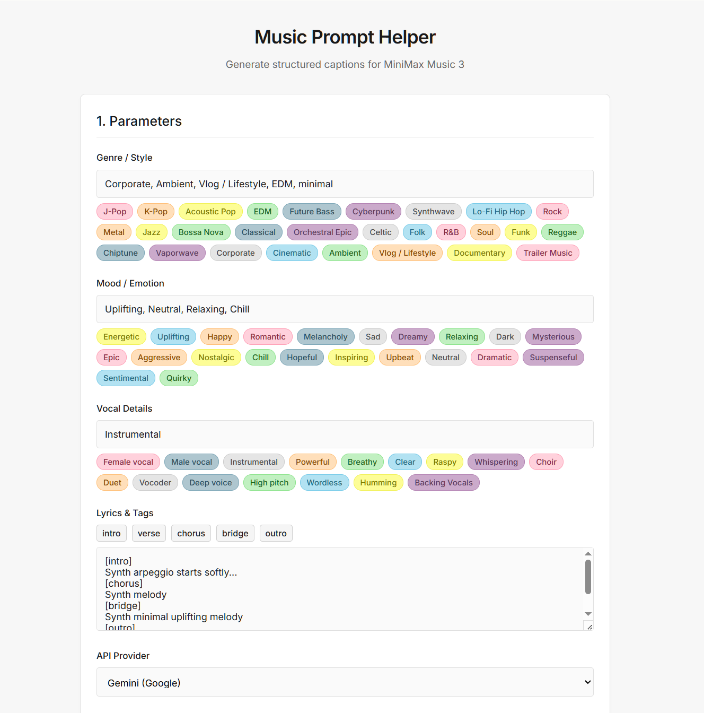

# MiniMax Music 3 Prompt Helper

[English](README.md) | 日本語

MiniMax Music 3をComfyUIワークフローで使う際に、構造化された音楽キャプションとタグ付き歌詞の作成を補助する、非公式のブラウザアプリです。

短い音楽アイデアから、次の2項目を生成します。

- `caption`：Global Metadata、Vocal Details、Arrangementで構成された音楽説明
- `lyrics`：`[intro]`、`[verse]`、`[chorus]`などのセクションタグを含む歌詞

両方の項目を、小さなプロンプトJSONとしてダウンロードすることもできます。

> [@uekiy](https://github.com/uekiy)による独立したコミュニティープロジェクトです。MiniMaxおよびComfyUIの公式製品ではなく、提携・承認・サポートを受けたものではありません。



*ジャンル、ムード、ボーカル、歌詞タグの候補を備えたパラメーター編集画面。*

## 主な機能

- ジャンル、ムード、ボーカル表現の候補ボタン
- 歌詞セクションタグの挿入
- Gemini、OpenAI、Anthropicを利用したプロンプト整形
- 構造化キャプションと整形済み歌詞の出力
- ワンクリックコピー
- ComfyUIワークフローへ値を移すためのプロンプトJSON保存
- APIキーの任意のブラウザ保存
- ビルドやパッケージインストールが不要

内蔵候補の説明は、[日本語タグリファレンス](tags_reference.ja.md)または[英語タグリファレンス](tags_reference.md)をご覧ください。

## 必要なもの

- モダンなデスクトップブラウザ
- 対応プロバイダーのAPIキー（いずれか1つ以上）
- 選択したAPI、およびGoogle Fontsから読み込むInterフォントへのインターネット接続

プロバイダーのモデル名やAPI提供状況は変更されることがあります。また、ブラウザからの直接リクエストは、プロバイダーのCORSポリシーやアカウント設定の影響を受ける場合があります。

## ローカルで起動する

このリポジトリをダウンロードまたはクローンし、プロジェクトフォルダでローカルWebサーバーを起動します。例：

```bash
python -m http.server 8000
```

次のURLを開きます。

```text
http://localhost:8000
```

ブラウザによっては`index.html`を直接開いても動作しますが、安定した動作のためローカルHTTPサーバーを推奨します。

## 使い方

1. ジャンル／スタイル、ムード、ボーカル特性、必要に応じてタグ付き歌詞を入力します。
2. 候補ボタンを押して表現を追加します。
3. Gemini、OpenAI、Anthropicのいずれかを選びます。
4. 選択したプロバイダーのAPIキーを入力します。
5. 信頼できる端末で保存したい場合のみ、**Remember this key in this browser**を有効にします。
6. **Generate Prompt**を押します。
7. キャプションと歌詞をComfyUIのMiniMax Music 3ワークフロー内の対応入力へコピーするか、プロンプトJSONをダウンロードします。

出力例：

```json
{
  "caption": "Global Metadata: ...\nVocal Details: ...\nArrangement: ...",
  "lyrics": "[intro]\n[verse]\n...\n[chorus]\n..."
}
```

ダウンロードファイルは`caption`と`lyrics`を格納したプロンプトデータです。完全なComfyUIワークフローJSONではありません。

## APIキーとプライバシー

- APIリクエストは、ブラウザから選択したプロバイダーへ直接送信されます。
- 入力した音楽情報や歌詞もリクエストに含まれます。
- APIキーはダウンロードするプロンプトJSONには含まれません。
- 初期状態では、新しく入力したAPIキーは永続保存されません。
- **Remember this key in this browser**を有効にすると、ブラウザの`localStorage`へ保存されます。暗号化はされません。
- 対応している場合は利用制限付きキーを使い、信頼できる端末でのみ利用し、使用後は保存済みキーを消去してください。
- **Clear saved API keys**を押すと、このアプリが現在のブラウザプロファイルに保存した全プロバイダーのキーを削除できます。

利用前に、選択したプロバイダーの利用規約、プライバシーポリシー、料金、キー管理方法をご確認ください。

## MiniMax Music 3のプロンプト構造

このヘルパーは、MiniMax Music 3プロジェクトで説明されている3部構成のStructured Captionを参考にしています。

- **Global Metadata**：ジャンル、ムード、テンポ、楽器、プロダクション特性
- **Vocal Details**：ボーカルの有無、声域、音色、歌唱法、感情表現
- **Arrangement**：セクションごとの楽曲展開

歌詞とタグは別の`lyrics`項目に保持されます。モデルのガイドや、より詳細なcaption rewriter資料は[MiniMax Music 3公式リポジトリ](https://github.com/MiniMax-AI/MiniMax-Music3)をご覧ください。

## 制限事項

- 生成内容は提案であり、必要に応じて編集してください。
- プロバイダーのAPIやモデル識別子は、このプロジェクトとは独立して変更される場合があります。
- ブラウザからの直接APIアクセスは、すべてのプロバイダー、ブラウザ、地域、アカウント設定で動作するとは限りません。
- このアプリ自体はMiniMax Music 3やComfyUIを実行しません。
- ダウンロードJSONはComfyUIワークフローを自動的にインストールまたは変更しません。

## ファイル構成

```text
index.html               アプリ画面
style.css                スタイル
script.js                UI、API呼び出し、JSON出力
README.md                英語ドキュメント
README.ja.md             日本語ドキュメント
tags_reference.md        英語タグリファレンス
tags_reference.ja.md     日本語タグリファレンス
LICENSE                  MIT License
```

## クレジット

- [MiniMax Music 3](https://github.com/MiniMax-AI/MiniMax-Music3)
- [ComfyUI](https://github.com/comfyanonymous/ComfyUI)

MiniMax、ComfyUI、Google、Gemini、OpenAI、ChatGPT、Anthropic、Claudeは、各所有者の商標または名称です。名称の記載は、提携や推奨を意味しません。

## ライセンス

Copyright (c) 2026 uekiy

[MIT License](LICENSE)で公開します。
